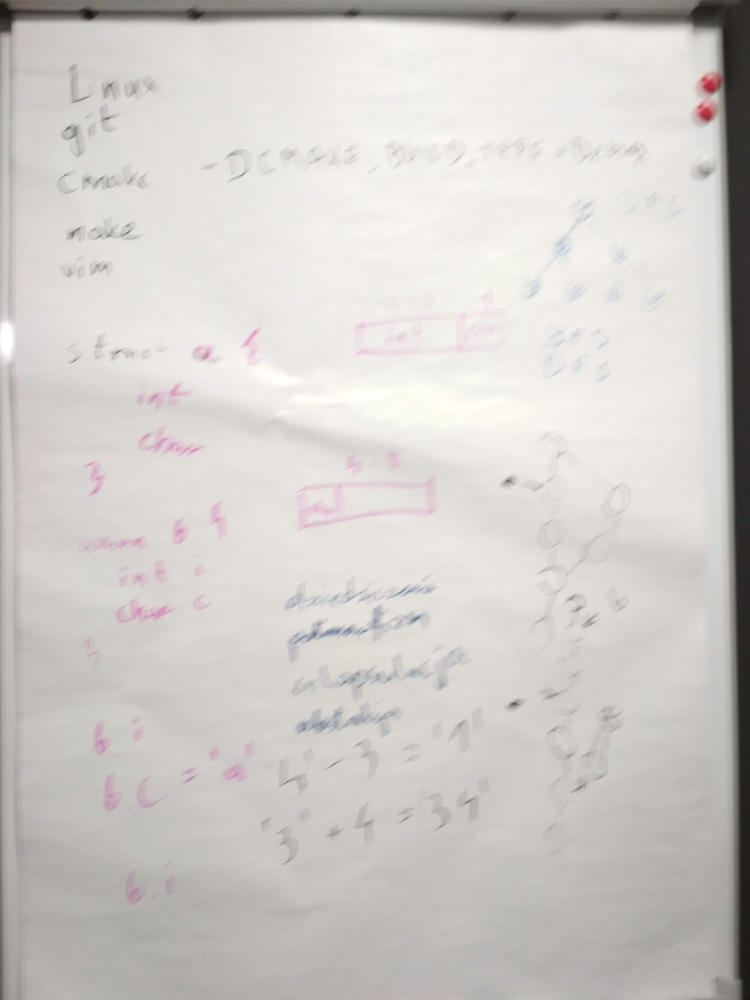
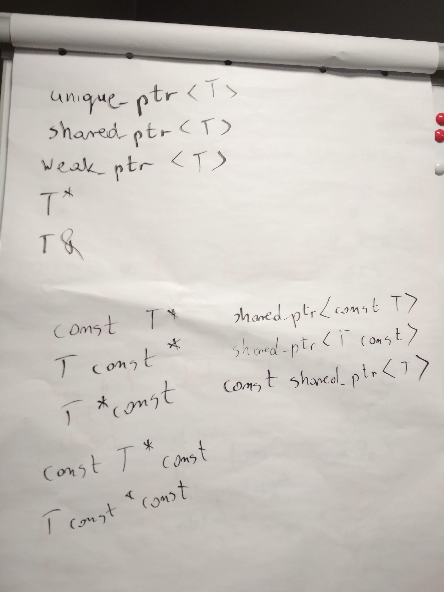
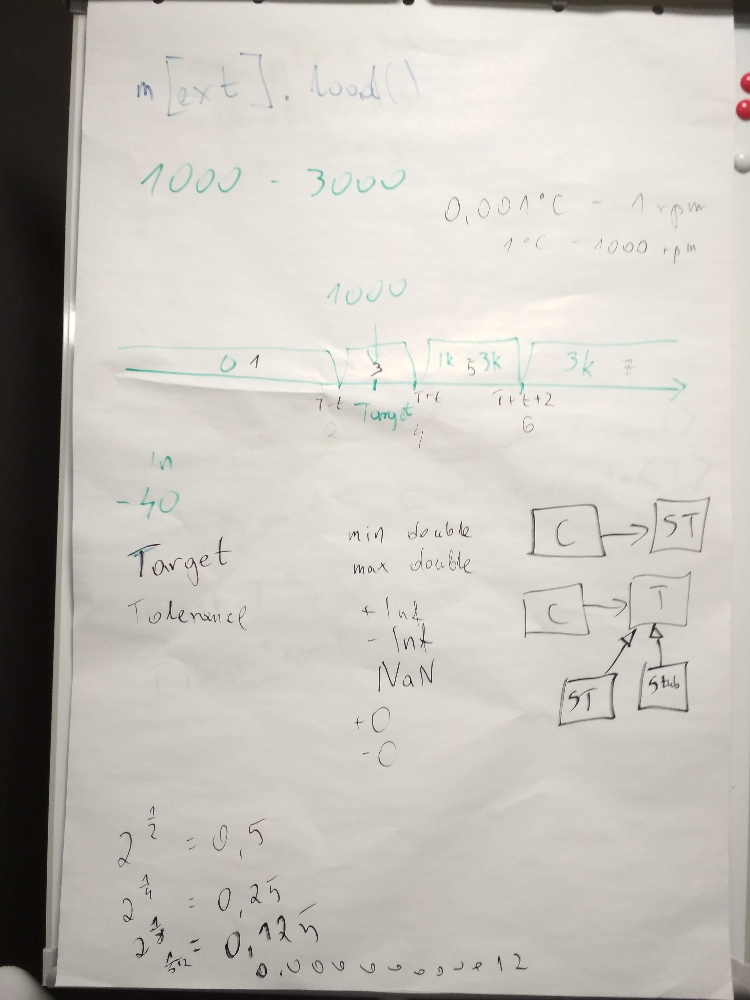

# Kurs-CPP

Materiały z kursu C++ (Lipiec 2019 - Wrzesień 2019)

## Grupa weekendowa

### 21.09.2019 Powtórka

## Grupa wieczorowa

### 30.09.2019 Powtórka

### Poprzedni Pre-work

- [x] Przygotuj sobie listę pytań z C++ lub szeroko pojętej inżynierii oprogramowania, na które chcesz poznać odpowiedzi :)
- [x] (25 punktów) Dla chętnych: przygotuj wystąpienie / prezentacje / nagranie / wydruki / dowolną formę przekazu, która streści jeden z tematów który przerabialiśmy. Zaprezentuj ją na kolejnych zajęciach. Nie powinno to trwać dłużej niż 10 minut.

### Materiały

- Repo [fan_controller](https://github.com/coders-school/fan_controller)

### Nagrania i foto

#### Grupa weekendowa

-  
  
- [21.09.2019 Wzorce projektowe: Abstract Factory, Strategy](https://www.youtube.com/watch?v=farsBucGoN8&list=PLQqoaQUqs4DCoZOgDbqR-KfGSxParz1Pf&index=49)
- [21.09.2019 Powtórka wszystkiego: testowanie na repo fan_controller, zarządzanie pamięcią i inne](https://www.youtube.com/watch?v=nOK2gZYSTw4&list=PLQqoaQUqs4DCoZOgDbqR-KfGSxParz1Pf&index=50)
- [21.09.2019 Praca domowa](https://www.youtube.com/watch?v=SppB1OZ4N9o&list=PLQqoaQUqs4DCoZOgDbqR-KfGSxParz1Pf&index=51)

#### Grupa wieczorowa

- [30.09.2019 Omówienie testu](https://www.youtube.com/watch?v=eBh77rINbQ4&list=PLQqoaQUqs4DCaFPwa3qfVlJc9YOfZkPAO&index=48)
- [30.09.2019 Struktura projektu obiektowego](https://www.youtube.com/watch?v=Co6qsbvuz7w&list=PLQqoaQUqs4DCaFPwa3qfVlJc9YOfZkPAO&index=49)
- [30.09.2019 Testowanie](https://www.youtube.com/watch?v=6EEPuBKGQ-0&list=PLQqoaQUqs4DCaFPwa3qfVlJc9YOfZkPAO&index=50)
- [30.09.2019 Mockowanie](https://www.youtube.com/watch?v=m_ljQF448aU&list=PLQqoaQUqs4DCaFPwa3qfVlJc9YOfZkPAO&index=51)
- [30.09.2019 Zarządzanie pamięcią](https://www.youtube.com/watch?v=8T7HPryN7BE&list=PLQqoaQUqs4DCaFPwa3qfVlJc9YOfZkPAO&index=52)
- [30.09.2019 Przegląd tematów i praca domowa](https://www.youtube.com/watch?v=oYKvVfFveco&list=PLQqoaQUqs4DCaFPwa3qfVlJc9YOfZkPAO&index=53)

### Post-work

- [ ] (do 63 punktów) Wypełnij [Test końcowy](https://forms.gle/FxJ3b4qyFF8B1dNb9). Czas do 02.10.2019.

### Ostatni pre-work :)

- [ ] Przygotuj swoje CV na kolejne zajęcia. Przynieś je wydrukowane.
- [ ] Przejrzyj w internecie przykładowe pytania z rozmów kwalifikacyjnych i przygotuj sobie te, na które chcesz poznać prawidłowe odpowiedzi :)
- [ ] Przygotuj sobie komentarze odnośnie naszego kursu. Co się podobało, a co moglibyśmy ulepszyć.
- [ ] Jeśli nie jest to dla Ciebie problemem, udostępnij na swoich mediach społecznościowych post Coders School o naszych przyszłych kursach (w przygotowaniu)
- [ ] Zapisz się na [newsletter](https://coders.school/#newsletter), aby otrzymywać powiadomienia o przyszłych kursach (w planach mamy kurs C++ online, Wielowątkowość w C++, C++20, kurs Pythona)

Osoby, które jeszcze nie wystawiły rekomendacji / opinii - ślicznie proszę o takowe \^_\^

- [LinkedIn - Łukasz](https://www.linkedin.com/in/lukaszziobron)
- [LinkedIn - Ihor](https://www.linkedin.com/in/ihor-rudynskyi-86a81b172/)
- [Facebook - Coders School](https://www.facebook.com/szkola.coders.school)
- [Google - Coders School](https://www.google.pl/maps/place/Coders.school/@50.7742468,8.0424075,5z/data=!3m1!4b1!4m5!3m4!1s0x470fc20ffeb98a75:0x9c523147244dbb99!8m2!3d51.1049959!4d17.0086049)
